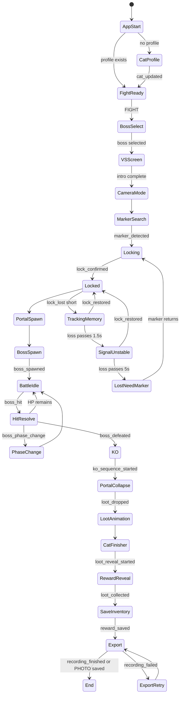
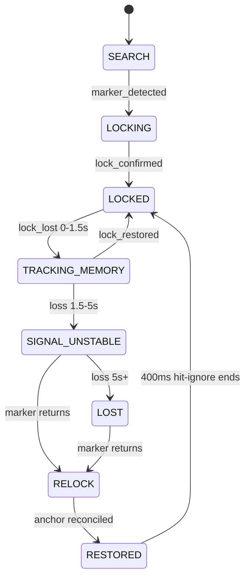
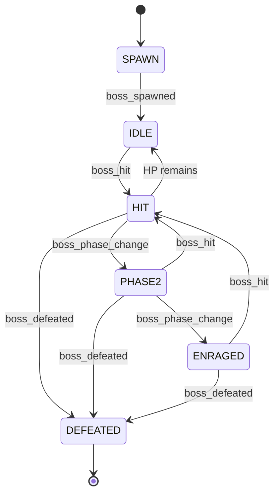
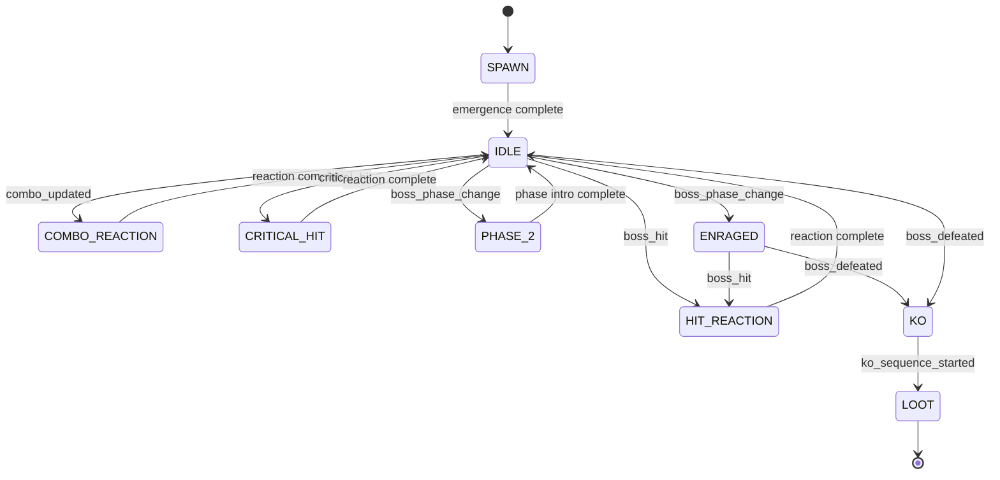
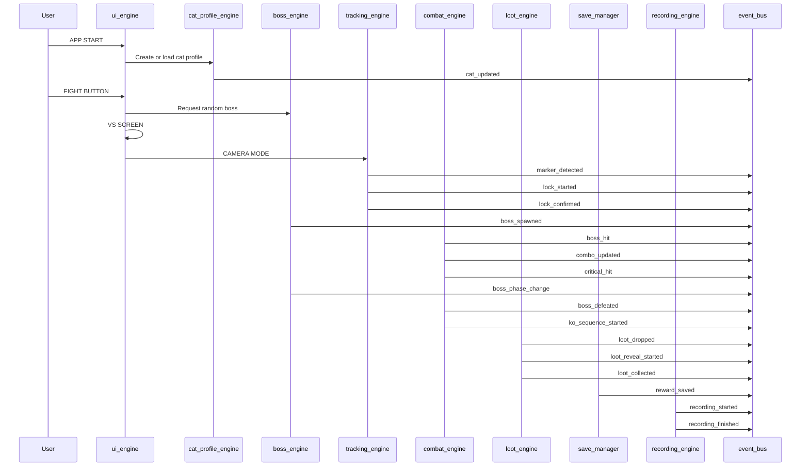
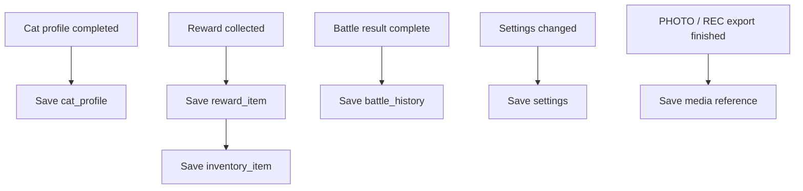
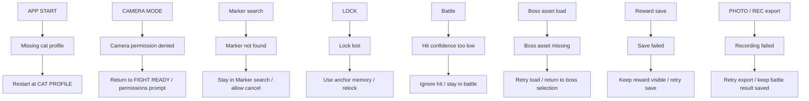
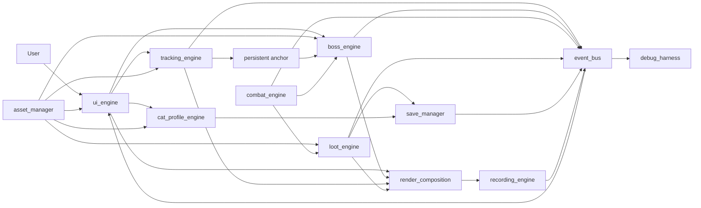
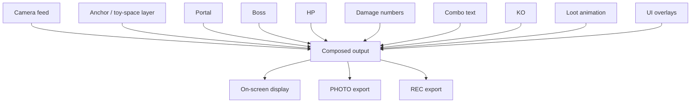

# Game Flow Map V1

Project title: LoopyCat RPG AR

Internal title: Loopy TV RPG

## Goal

See the full playable loop before more coding.

Do not add features.

This document maps the first playable journey, state flow, event flow, save points, fail states, restart points, and architecture view.

## Scope Lock

This flow map covers only the first playable chain:

```text
camera
-> marker lock
-> persistent anchor
-> boss stays on toy
-> hit
-> HP drop
-> KO
-> loot drop
-> composed photo/video
```

Frozen for now:

- 10 bosses
- Full inventory
- Cat 2.5D rig
- AR fitting
- Worlds
- Seasons
- Monster Book
- Cat Kingdom
- Social cards

## User Journey

```mermaid
flowchart TD
  A["APP START"] --> B["CAT PROFILE"]
  B --> B1["Photo"]
  B1 --> B2["Name"]
  B2 --> B3["Title"]
  B3 --> C["FIGHT BUTTON"]
  C --> D["Random boss selection"]
  D --> E["VS SCREEN"]
  E --> E1["Cat Hero"]
  E1 --> E2["VS"]
  E2 --> E3["Boss"]
  E3 --> F["CAMERA MODE"]
  F --> G["Marker search"]
  G --> H["TARGET LOCK"]
  H --> I["Portal spawn"]
  I --> J["Boss appears"]
  J --> K["Battle starts"]
  K --> L["Hit detection"]
  L --> M["Damage"]
  M --> H1["HP drop"]
  H1 --> N["Combo"]
  N --> O["Critical"]
  O --> P["Boss phase change"]
  P --> Q["KO"]
  Q --> R["Portal collapse"]
  R --> S["Loot animation"]
  S --> T["Cat finisher"]
  T --> U["Reward reveal"]
  U --> V["Save inventory"]
  V --> W["PHOTO / REC export"]
  W --> X["END"]
```



## Runtime State Diagram



## Tracking State Diagram



Tracking rule:

- Marker is needed for acquisition.
- Persistent anchor is battle truth after lock.
- Boss does not disappear during tracking memory states.

## Combat State Diagram



## Boss Animation State Diagram



## Event Diagram



Event ownership rule:

- Each event in this diagram has one owner.
- No duplicate emitters.
- UI can request actions, but does not own save or combat events.

## Save Points



Save point details:

| Save Point | Trigger | Owner | Required Result |
| --- | --- | --- | --- |
| Cat profile | Photo, name, title completed | `save_manager` | Local cat profile exists |
| Reward item | `loot_collected` | `save_manager` | Reward is stored |
| Inventory item | `loot_collected` | `save_manager` | Item appears in inventory data |
| Battle history | KO/reward flow complete | `save_manager` | Battle result is stored |
| Settings | User changes setting | `save_manager` | Local settings updated |
| Media reference | `recording_finished` or PHOTO saved | `save_manager` | Export reference stored |

Save rules:

- No cloud.
- No accounts.
- UI never writes save data directly.
- If reward save fails, stay on reward reveal and retry.

## Fail States



## Restart Points

| Restart Point | From Fail State | Restarts At | Must Preserve |
| --- | --- | --- | --- |
| Profile restart | Missing profile | `CAT PROFILE` | Existing local data if any |
| Permission retry | Camera denied | `CAMERA MODE` | Cat profile and selected boss |
| Marker retry | Marker not found | `Marker search` | Selected boss and battle setup |
| Relock retry | Lock lost | `RELOCK` / `Marker search` | Anchor memory, boss HP, combat state |
| Asset retry | Boss asset missing | `Random boss selection` | Cat profile |
| Save retry | Reward save failed | `Reward reveal` | Reward item and battle result |
| Export retry | Recording failed | `PHOTO / REC export` | Saved inventory and battle history |
| Full restart | Unrecoverable error | `APP START` | Local saves |

## Architecture View



Architecture rules:

- `event_bus` coordinates facts.
- `save_manager` owns local persistence.
- `asset_manager` lazy-loads content.
- `render_composition` owns the final composed frame.
- `recording_engine` captures composed output only.
- `debug_harness` observes; it does not own gameplay.

## Composed Output Map



Capture rule:

- PHOTO and REC must match what the user sees.
- Raw camera-only output is invalid.

## Full Playable Loop Checklist

- App starts.
- Cat profile has photo, name, and title.
- Fight button starts boss selection.
- VS screen appears before camera mode.
- Camera mode opens.
- Marker search starts.
- Lock confirms.
- Persistent anchor is created.
- Portal spawns from anchor.
- Boss appears on anchor.
- Battle starts.
- Hit detection emits `boss_hit`.
- Damage and HP update.
- Combo can update.
- Critical can trigger.
- Boss phase can change.
- KO starts.
- Portal collapses.
- Loot animation plays.
- Cat finisher plays.
- Reward reveal appears.
- Inventory save completes.
- PHOTO or REC exports composed output.
- Flow ends safely.

## Definition Of Done For Flow Map

Game Flow Map V1 is complete when:

- User journey is visible.
- State diagram is defined.
- Event diagram is defined.
- Save points are defined.
- Fail states are defined.
- Restart points are defined.
- Architecture view is defined.
- No new gameplay features are added.
